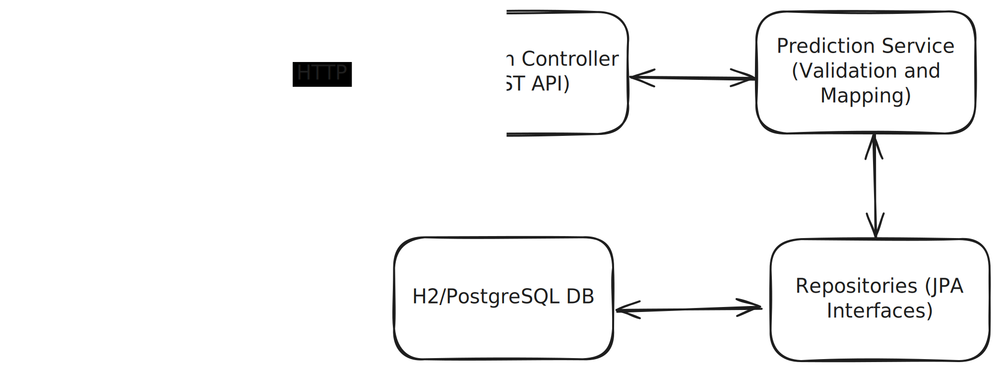

# prediction-service

Simple Spring Boot REST API for user match predictions.



## Features
* **Create** a prediction `POST /api/v1/predictions`
* **List** all predictions for a user `GET /api/v1/predictions?userId={userId}`
* **Update** a prediction's winner (before match starts) `PATCH /api/v1/predictions/{predictionId}`

## Getting Started

### Prerequisites
* **Local build:** Java 17+ and Maven
* **Docker-only build:** Docker & Docker Compose (no local Java/Maven needed)

### Running Locally
1. Build and run:

With Docker:

```bash
docker-compose up --build
```

Without Docker:

```bash
mvn clean package
java -jar target/prediction-service-0.0.1-SNAPSHOT.jar
```

2. The app will start on `http://localhost:8080`.
3. **H2 console** (in‑memory DB seeded via `data.sql`):
    * URL: `http://localhost:8080/h2-console`
    * JDBC URL: `jdbc:h2:mem:testdb;DB_CLOSE_DELAY=-1;DB_CLOSE_ON_EXIT=FALSE`
    * User: `sa`
    * Password: *(leave blank)*

On startup, Hibernate (`ddl-auto=update`) creates the schema and Spring SQL init (`spring.sql.init.mode=always`) runs `data.sql`, inserting sample matches:

```sql
INSERT INTO match (sport, start_time, home_team, away_team) VALUES
    ('Volleyball',  '2025-04-21T12:30:00Z', 'Team 1', 'Team 2'),
    ('Football',    '2025-04-27T15:00:00Z', 'Team 3', 'Team 4'),
    ('Basketball',  '2029-05-15T21:30:00Z', 'Team 5', 'Team 6');

```

4. **Health check** (Actuator):

```bash
curl http://localhost:8080/actuator/health # → { "status": "UP" }
```

After startup, the H2 console and REST API are available at `http://localhost:8080`.

## Example Requests

Also available as a Postman collection in postman_collection.json.

1. **Create a prediction**

```bash
curl -i -X POST http://localhost:8080/api/v1/predictions \
  -H "Content-Type: application/json" \
  -d '{"userId":123,"matchId":2,"predictedWinner":"Team 3"}'
```

2. **List predictions for a user**

```bash
curl --location 'http://localhost:8080/api/v1/predictions?userId=123'
```

3. **Update a prediction's winner**

```bash
curl -i -X PATCH http://localhost:8080/api/v1/predictions \
  -H "Content-Type: application/json" \
  -d '{"predictedWinner":"Team B", "predictionId": "1"}'
```

## Design & Local‑Dev Assumptions
* **In‑memory H2** for local simplicity; seeded via `data.sql`
* **Hibernate** `ddl-auto=update` drives schema creation
* **No authentication** (we trust `userId` in the payload)
* **Versioned API** under `/api/v1`
* **Partial updates** via `PATCH`

When moving to production H2 would be replaced with Postgres or similar, and pull live matches in from an external sports‑data feed.

## Extensions

### Testing
- Tests designed via TDD: test cases have already been outlined in plain English and should be implemented next.
- Complete unit tests for service and repository layers.
- Complete component tests for controllers using MockMvc or similar.
- Complete end-to-end tests (integration tests) using Testcontainers or a real database instance.

### Logging
- Integrate structured logging with SLF4J/Logback.
- Add request/response logging filters or interceptors.
- Configure and externalize log levels for different packages.

### Security
- Add Spring Security + JWT, scope predictions to the authenticated user.
### Performance
- Add caching for “open” matches, bulk‐prediction endpoints, pagination on list operations.
### Observability
- Integrate distributed tracing (e.g. Sleuth/Zipkin) and structured logs.
### CI/CD 
- Set up a CI/CD pipeline to automatically run tests, build and publish the Docker image, and deploy new versions to staging or production environment on every merge.
### Architecture improvements
- **Add an API Gateway & Load Balancer** centralize SSL termination, authentication/rate‑limiting and distribute traffic across multiple service instances for high availability.
- **Introduce Caching & Read‑Replicas** deploy Redis (or similar) for hot‑path data and scale out read traffic via database replicas to reduce latency under load.
- **Adopt Event‑Driven Processing** publish prediction and match events to a message broker (e.g. Kafka) and handle scoring or notifications asynchronously in dedicated worker services.  
